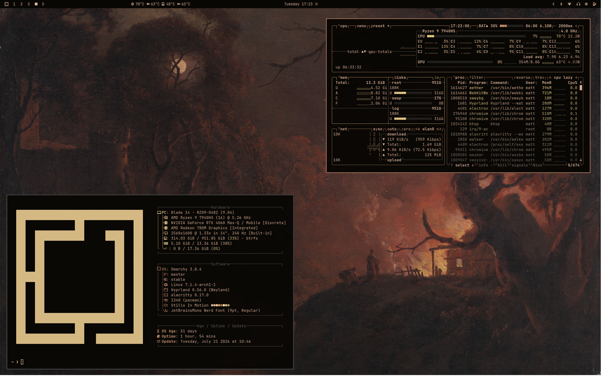
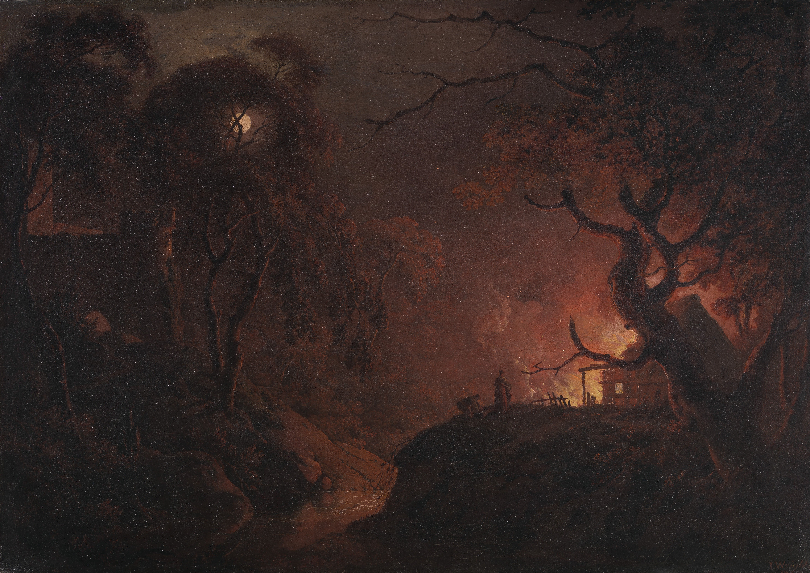
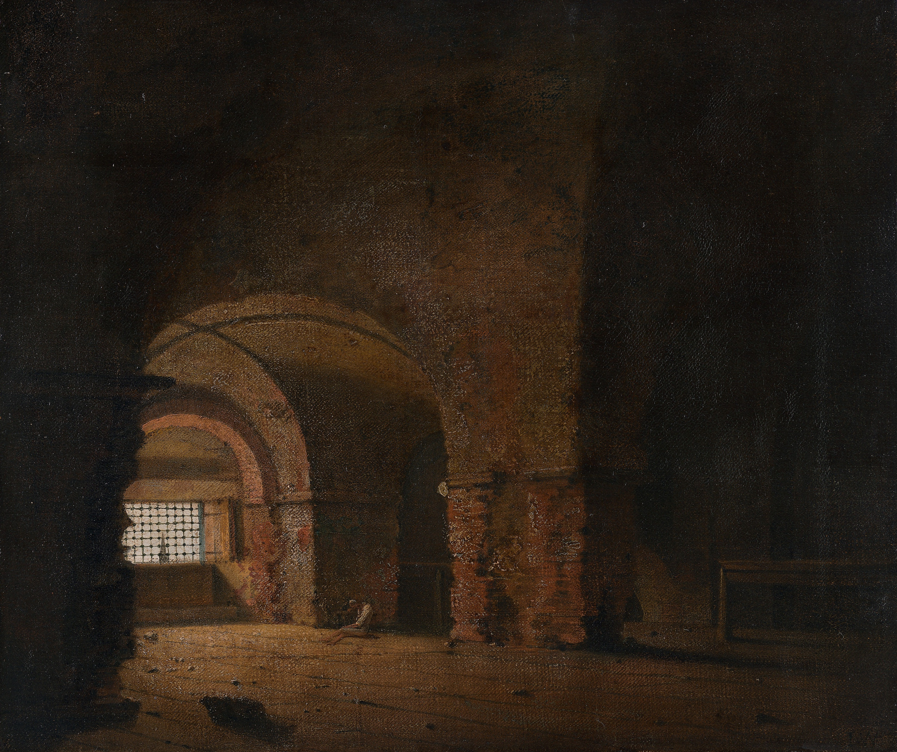

# Fire & Shadow

A dark Omarchy theme inspired by the paintings of Joseph Wright.


  [](https://github.com/mattbbia?tab=repositories)  

 



## Inspiration

Joseph Wright of Derby (1734–1797) was a master of atmosphere. He was known for his dramatic use of light and shadow to evoke a feeling of mystery in the observer. The selected paintings showcase Wright's ability to illuminate firelight, moonlight and a volcanic glow, creating a moody, cinematic collection that lends itself well to a dark desktop environment.
## Gallery

This project includes 4 carefully selected paintings:

| Preview | Artwork |
| ------- | ------- |
|  | Cottage on Fire at Night (between 1785–1793) |
|  | The Dead Soldier (ca. 1789) |
|  | The Prisoner (1787–1790) |
|  | Vesuvius from Posillipo (ca. 1788) |
## Color Palette

### Backgrounds

 
 

### Rustic Browns


### Warm Illumination


## Components

- Aether
- Alacritty
- btop
- Chromium
- Foot
- Ghostty
- Hyprland
- Kitty
- Neovim
- Omarchy Shell (bar, lock screen, notifications, launcher, on-screen display)
- Vencord
- VS Code
- Warp
- Zellij

## Installation

Clone or install the project:
```bash
omarchy-theme-install https://github.com/mattbbia/fire-and-shadow.git
```
### OR

1. Open the Omarchy menu (**Super + Alt + Space**).
2. Go to **Install > Style > Theme**.
3. Paste this repo URL: `https://github.com/mattbbia/fire-and-shadow.git`
4. Hit Enter.

## Contributing

Contributions, bug reports, feature requests, and suggestions are welcome. Feel free to open an issue or submit a pull request.

## Support

If you enjoy this theme and would like to support future themes, you can:

- ⭐ Star this repository
- 💡 Suggesting new themes
- ☕ Supporting future themes

[](https://buymeacoffee.com/mattbbia)

## Acknowledgements

Artwork by **Joseph Wright of Derby (1734–1797)**. Images sourced from the **Yale Center for British Art** collection.

## License

This project is licensed under the MIT License. See the LICENSE file for details.
